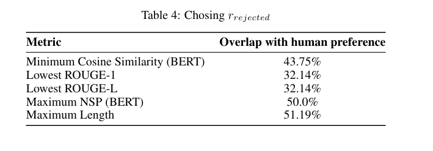

# HPC Training
```
#!/bin/bash
#
#SBATCH --job-name=training
#SBATCH --gres=gpu:v100:4
#SBATCH --nodes 1
#SBATCH --account=csci_ga_3033_102-2023fa
#SBATCH --partition=n1c24m128-v100-4
#SBATCH --time=20:10:00
#SBATCH --mail-type=END
#SBATCH --output=%jmain.out
#SBATCH --error=%jmaintester.err
module purge
singularity exec --nv --bind /scratch/as14661 --overlay /scratch/as14661/as14661/jup_env/my_pytorch.ext3:ro /share/apps/images/cuda11.6.124-cudnn8.4.0.27-devel-ubuntu20.04.4.sif /bin/bash \
-c "source /ext3/env.sh; cd /scratch/as14661/as14661/trl/examples/scripts; python reward_modeling.py"
```
# Training Details
- DeBERTA-v3 large model
- Models are trained on both zero-shot and few-shot configurations.
- A maximum sequence length of 512 tokens is chosen based on data distribution observations.
- Fine-tuning strategy employs Low Rank Adaptation (LoRa) with a rank setting of 8.
- Initial learning rate is set between \(1 x 10^{-5}\) and \(1 x 10^{-6}\).
- Gradient accumulation is used to enable larger effective batch sizes, ranging from 64 to 512.
- Two learning rate schedulers are utilized: linear and cosine annealing.
- Warmup period is set to 10% of the total number of training steps.
- Training is confined to a single epoch, following the methodology of Touvron et al., 2023.
- Modified loss function equation: `loss = -log(σ(r_chosen - r_rejected0 - r_rejected1 - r_rejected2))`, where `r_rejected0`, `r_rejected1`, and `r_rejected2` represent outputs for all three untruthful responses.


# Chosing r_rejected


